# RoboShop Enterprise Configuration with Ansible Roles & AWS Secrets Manager (`ansible-roboshop-roles`)

> Enterprise Configuration Management for the RoboShop Multi-Tier Microservices Architecture featuring **Ansible Roles**, **AWS Secrets Manager & SSM Parameter Store Lookups**, **Rolling Updates (`serial: 3`)**, **AWS Dynamic Inventory (`aws_ec2`)**, and **Shared Task Inheritance (`roles/common`)**.

---

## 📑 Table of Contents
1. [Project Overview](#1-project-overview)
2. [Live Application UI Showcase (Production Deployment)](#2-live-application-ui-showcase-production-deployment)
3. [Key Enterprise Architecture Highlights](#3-key-enterprise-architecture-highlights)
4. [High-Level System Architecture & Flowchart](#4-high-level-system-architecture--flowchart)
5. [Role Architecture & Reusable Common Layer](#5-role-architecture--reusable-common-layer)
6. [Enterprise Best Practices in this Repository](#6-enterprise-best-practices-in-this-repository)
   - [AWS Secrets Manager Integration (`group_vars/mysql/vault.yaml`)](#1-aws-secrets-manager-integration-group_varsmysqlvaultyaml)
   - [Rolling Deployments with `serial: 3` (`roboshop.yaml`)](#2-rolling-deployments-with-serial-3-roboshopyaml)
   - [AWS EC2 Dynamic Inventory Plugin (`frontend.aws_ec2.yaml`)](#3-aws-ec2-dynamic-inventory-plugin-frontendaws_ec2yaml)
   - [Static vs Dynamic Task Composition (`import_role` vs `include_role`)](#4-static-vs-dynamic-task-composition-import_role-vs-include_role)
7. [Component Roles Deep Dive](#7-component-roles-deep-dive)
   - [Database Roles (MongoDB, Redis, MySQL, RabbitMQ)](#1-database-roles)
   - [Microservice Roles (Catalogue, User, Cart, Shipping, Payment)](#2-microservice-roles)
   - [Web Tier Role (Frontend / Nginx)](#3-web-tier-role)
8. [Infrastructure Provisioning & Route 53 DNS Setup (Pre-requisite)](#8-infrastructure-provisioning--route-53-dns-setup-pre-requisite)
   - [Separation of Concerns: IaaS vs Configuration Management](#1-separation-of-concerns-iaas-vs-configuration-management)
   - [End-to-End Infrastructure Provisioning Architecture](#2-end-to-end-infrastructure-provisioning-architecture)
   - [EC2 & Route 53 Provisioning Playbook Breakdown](#3-ec2--route-53-provisioning-playbook-breakdown)
   - [Infrastructure Creation Commands](#4-infrastructure-creation-commands)
   - [How Route 53 Integrates with `inventory.ini`](#5-how-route-53-integrates-with-inventoryini)
   - [DNS Resolution & Network Connectivity Pre-Flight Check](#6-dns-resolution--network-connectivity-pre-flight-check)
   - [Infrastructure Teardown / Decommissioning Command](#7-infrastructure-teardown--decommissioning-command)
9. [Step-by-Step Deployment Runbook (Ansible Roles Execution)](#9-step-by-step-deployment-runbook-ansible-roles-execution)
10. [Deployment Execution Evidence (Terminal Runs)](#10-deployment-execution-evidence-terminal-runs)
11. [Verification, Health Checks & Troubleshooting](#11-verification-health-checks--troubleshooting)
    - [Part A: From Ansible Control Node / Workstation](#part-a-from-ansible-control-node--workstation)
    - [Part B: From Inside Each Target Component Server (via SSH)](#part-b-from-inside-each-target-component-server-via-ssh)
    - [Part C: Common Errors & Resolution Runbook](#part-c-common-errors--resolution-runbook)


---

## 1. Project Overview

Managing configurations across 10 distributed microservices in multi-instance production environments demands strict security, zero downtime, and code reusability.

**`ansible-roboshop-roles`** represents an enterprise-ready implementation of Ansible for the RoboShop platform:
* **Fully Modularized Roles:** Replaces monolithic playbooks with structured, self-contained roles in the `roles/` directory.
* **Secrets Management without Hardcoding:** Sensitive credentials (such as database root passwords) are fetched dynamically at runtime from **AWS Secrets Manager** or **SSM Parameter Store** using Jinja2 lookup plugins.
* **Zero-Downtime Rolling Updates:** Playbooks implement `serial: 3` batches, updating a subset of servers at a time to keep services available during releases.
* **Dynamic Inventory Discovery:** The `amazon.aws.aws_ec2` plugin automatically discovers running instances by AWS tags without requiring manually maintained IP lists.

---

## 2. Live Application UI Showcase (Production Deployment)

> 🚀 **Live Production Deployment:** The multi-tier microservices application successfully running on AWS EC2, configured end-to-end via `ansible-roboshop-roles`, reverse-proxied via Nginx, and connected to distributed databases.

```
Domain: http://roboshop-dev.aitechapp.fun
Architecture: 10 Microservices (NodeJS, Java, Python, Nginx, MongoDB, Redis, MySQL, RabbitMQ)
Secrets: AWS Secrets Manager | Concurrency: serial: 3 | Discovery: AWS EC2 Dynamic Inventory
```

### 1. Storefront Landing & Microservices Gateway (`roboshop-app-1.png`)
*The customer-facing storefront served via Nginx reverse proxy, routing traffic across Catalogue, User, Cart, Shipping, and Payment backend services.*

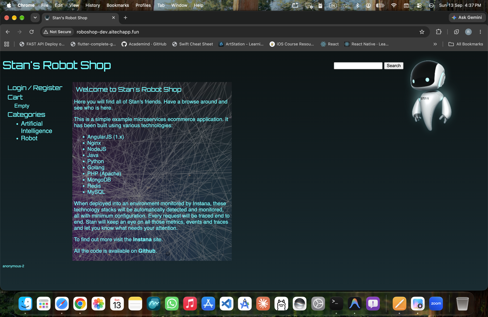

---

### 2. User Authentication & Profile Registration (`roboshop-app-2.png`)
*User service login and registration modal storing credentials in MongoDB and caching active user sessions in Redis.*

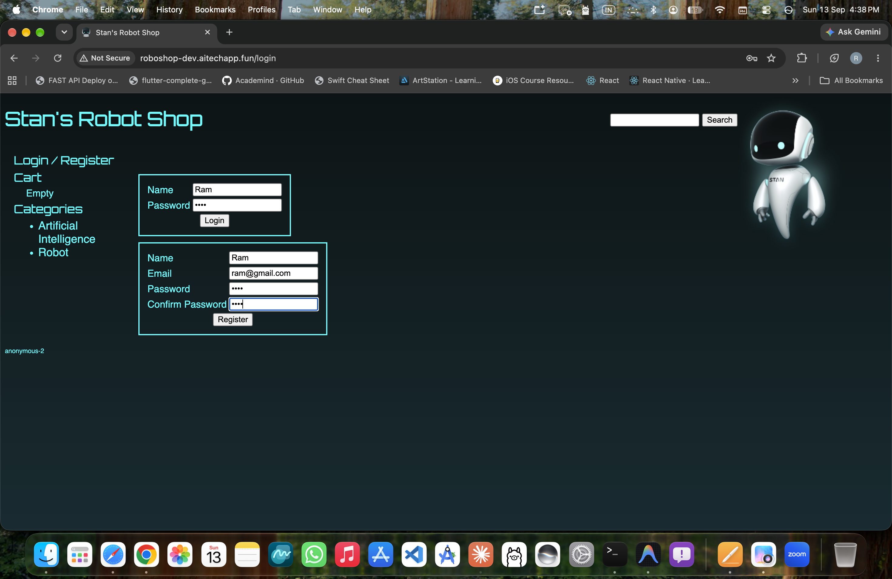

---

### 3. Authenticated Customer Dashboard & Order History (`roboshop-app-3.png`)
*User session validated against Redis cache with historical order lookup (`GET /api/user/history/:id`).*

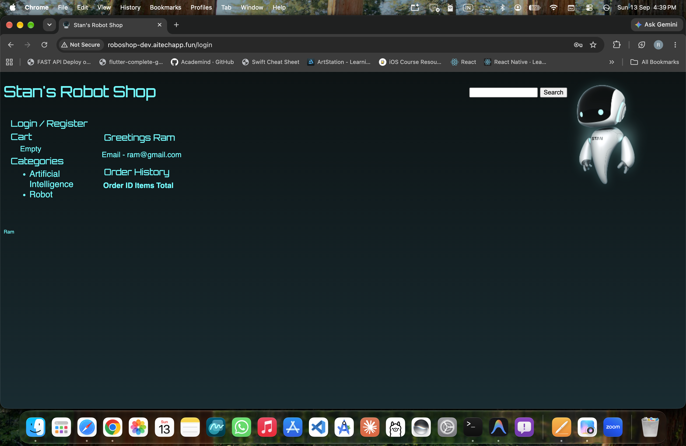

---

### 4. Product Details & Real-Time Catalogue (`roboshop-app-4.png`)
*Product item view dynamically queried from MongoDB via Catalogue Node.js microservice (`GET /api/catalogue/product/:id`).*

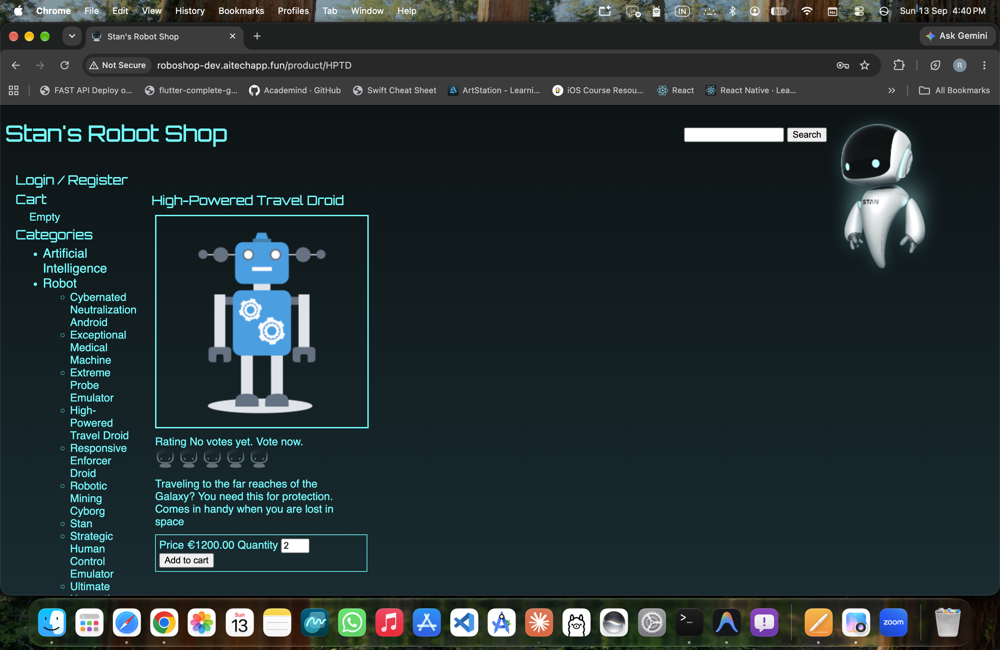

---

### 5. Automated Distance & Shipping Rate Calculation (`roboshop-app-5.png`)
*Shipping Java/Maven microservice calculating distance and freight costs via relational MySQL cities database.*

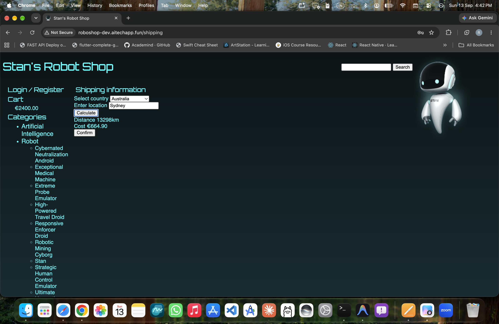

---

### 6. Cart Checkout & Tax Ledger Breakdown (`roboshop-app-6.png`)
*Cart microservice aggregation with tax calculation and pre-payment invoice review before payment dispatch.*

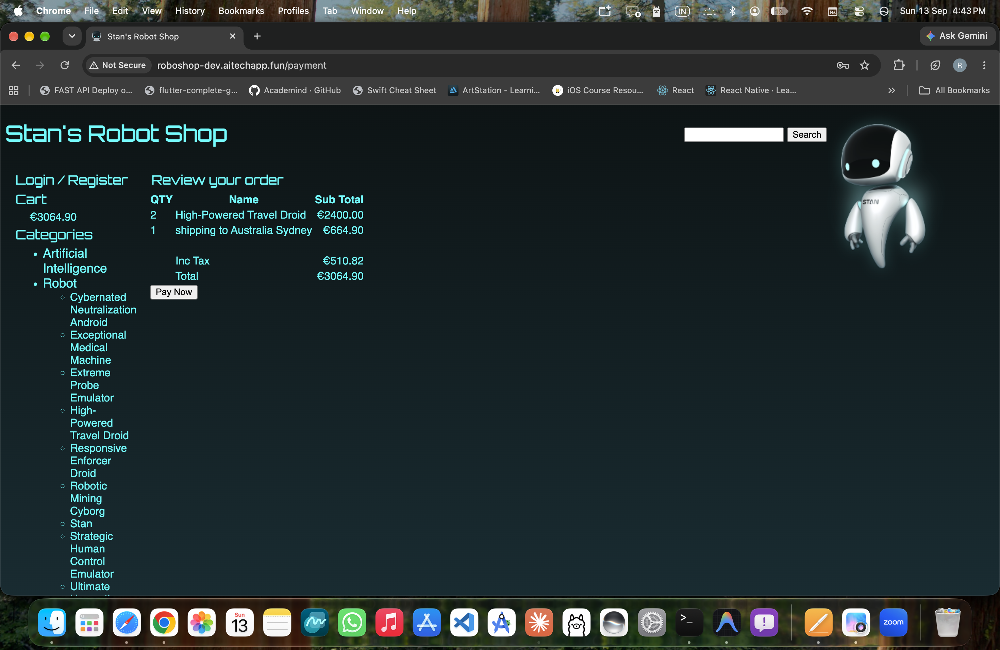

---

### 7. Asynchronous Payment Processing & Order Confirmation (`roboshop-app-7.png`)
*Payment Python microservice dispatching order events asynchronously via RabbitMQ AMQP queue with verified Order ID generation.*

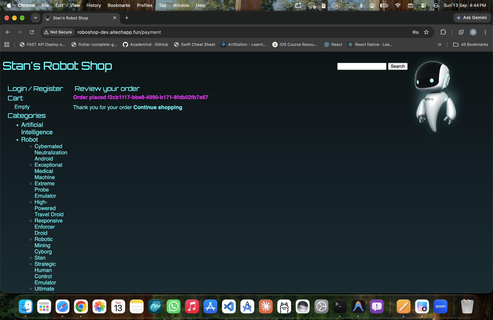

---

## 3. Key Enterprise Architecture Highlights

| Feature | Standard Playbook Approach | Enterprise Roles Approach (`ansible-roboshop-roles`) |
| :--- | :--- | :--- |
| **Code Organization** | Everything in flat `.yaml` files. Hard to scale. | Dedicated subdirectories (`tasks/`, `handlers/`, `templates/`, `files/`, `vars/`) per component. |
| **Secrets Management** | Hardcoded passwords or local files. | Dynamic runtime lookups via `lookup('amazon.aws.aws_secret')`. |
| **Deployment Strategy** | All hosts updated simultaneously (downtime risk). | Rolling deployment (`serial: 3`) across host batches. |
| **Inventory** | Static IP addresses in `inventory.ini`. | AWS EC2 Dynamic Inventory (`frontend.aws_ec2.yaml`). |
| **Code Reuse** | Repeated logic across playbooks. | Centralized [roles/common](file:///Users/sriramcharankolla/Desktop/DevOps/ansible-roboshop-roles/roles/common) imported across all microservices. |

---

## 4. High-Level System Architecture & Flowchart

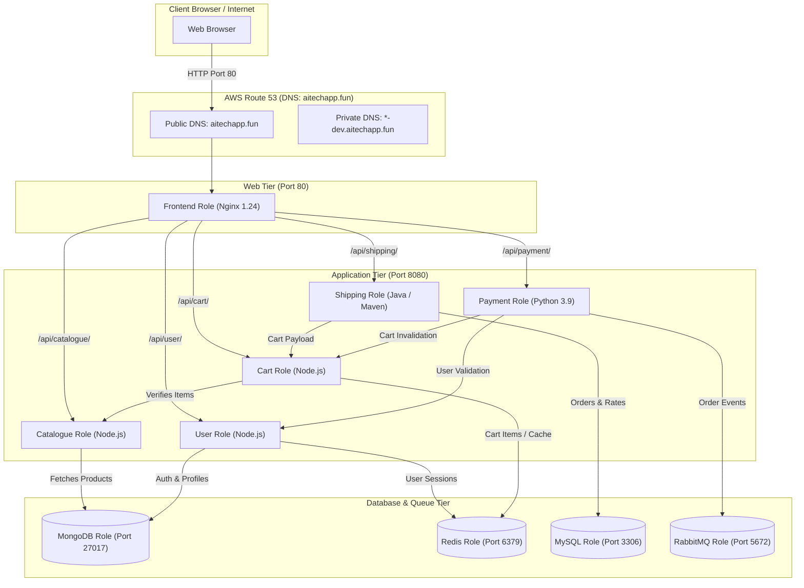

---

## 5. Role Architecture & Reusable Common Layer

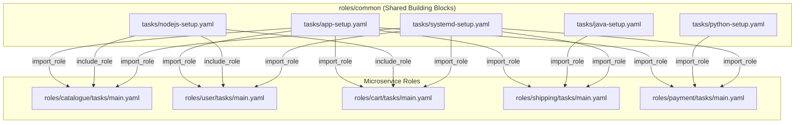

### Shared Tasks in [roles/common/tasks](file:///Users/sriramcharankolla/Desktop/DevOps/ansible-roboshop-roles/roles/common/tasks):
* **`app-setup.yaml`:** Provisions system user `roboshop`, manages `/app`, downloads and unarchives S3 artifacts.
* **`nodejs-setup.yaml`:** Configures Node.js 20 stream, installs packages, executes `npm install`.
* **`java-setup.yaml`:** Packages Java artifact via Maven (`mvn clean package`) and renames target JAR.
* **`python-setup.yaml`:** Configures Python 3, gcc, build tools, and runs `pip3 install -r requirements.txt`.
* **`systemd-setup.yaml`:** Deploys Jinja2 service unit template, runs `daemon-reload`, enables and starts service.

---

## 6. Enterprise Best Practices in this Repository

### 1. AWS Secrets Manager Integration (`group_vars/mysql/vault.yaml`)
Passwords and secrets are **never** committed to Git in plaintext. Instead, [group_vars/mysql/vault.yaml](file:///Users/sriramcharankolla/Desktop/DevOps/ansible-roboshop-roles/group_vars/mysql/vault.yaml#L1-L2) dynamically queries AWS Secrets Manager:

```yaml
MYSQL_ROOT_PASSWORD: "{{ (lookup('amazon.aws.aws_secret', 'roboshop/dev/mysql_root_password', region='us-east-1') | from_json).MYSQL_ROOT_PASSWORD }}"
```
During execution of [roles/mysql/tasks/main.yaml](file:///Users/sriramcharankolla/Desktop/DevOps/ansible-roboshop-roles/roles/mysql/tasks/main.yaml#L12-L13), Ansible retrieves the secret in memory and executes:
```yaml
- name: setup root password
  ansible.builtin.command: mysql_secure_installation --set-root-pass "{{ MYSQL_ROOT_PASSWORD }}"
```

### 2. Rolling Deployments with `serial: 3` (`roboshop.yaml`)
In [roboshop.yaml:L1-L6](file:///Users/sriramcharankolla/Desktop/DevOps/ansible-roboshop-roles/roboshop.yaml#L1-L6), the `serial` directive controls concurrency:

```yaml
- name: "configure {{ component }} server"
  hosts: "{{ component }}"
  become: yes
  serial: 3
  roles:
  - "{{ component }}"
```
* **How it works:** If you have 9 instances of a service, Ansible executes the play on **3 instances at a time**.
* The remaining 6 instances continue serving customer traffic, ensuring high availability and zero downtime during upgrades.

### 3. AWS EC2 Dynamic Inventory Plugin (`frontend.aws_ec2.yaml`)
[frontend.aws_ec2.yaml:L1-L36](file:///Users/sriramcharankolla/Desktop/DevOps/ansible-roboshop-roles/frontend.aws_ec2.yaml#L1-L36) eliminates the need to manually track or hardcode IP addresses by dynamically querying AWS EC2 APIs at runtime:

```yaml
# 1. Declare dynamic inventory plugin
plugin: amazon.aws.aws_ec2

# 2. Target AWS region
regions:
  - us-east-1

# 3. Use instance private IP as hostname
hostnames:
  - private-ip-address

# 4. Filter only running frontend instances
filters:
  instance-state-name: running
  tag:Name: frontend-dev

# 5. Connect via private IP address
compose:
  ansible_host: private_ip_address

# 6. Dynamically create the [frontend] group from tag Name (frontend-dev -> frontend)
keyed_groups:
  - separator: ''
    key: tags.Name | regex_replace('-.*$', '')
```

#### How Dynamic Groups & IP Discovery Work:
1. **Dynamic IP Resolution (`compose: ansible_host: private_ip_address`):**
   - Retrieves the private IP (e.g., `172.31.x.x`) directly from the AWS EC2 metadata and assigns it to `ansible_host`, instructing SSH to route directly to that private IP.
2. **Automatic Group Creation (`keyed_groups`):**
   - Inspects the EC2 tag `tag:Name: frontend-dev`.
   - The regex `regex_replace('-.*$', '')` strips `-dev`, creating a dynamic Ansible group named **`[frontend]`**.
   - In [roboshop.yaml:L1-L2](file:///Users/sriramcharankolla/Desktop/DevOps/ansible-roboshop-roles/roboshop.yaml#L1-L2), `hosts: "{{ component }}"` matches `component=frontend` directly to this dynamically formed group.
3. **Graph Inspection Command:**
   ```bash
   ansible-inventory -i frontend.aws_ec2.yaml --graph
   ```


### 4. Static vs Dynamic Task Composition (`import_role` vs `include_role`)
Demonstrated in [include-vs-import.yaml](file:///Users/sriramcharankolla/Desktop/DevOps/ansible-roboshop-roles/include-vs-import.yaml#L1-L5):
* `import_role`: Static pre-processing at playbook compile time. Used for structural blocks like `app-setup` and `systemd-setup`.
* `include_role`: Dynamic runtime inclusion. Supports loops and dynamically evaluated conditionals.

---

## 7. Component Roles Deep Dive

### 1. Database Roles
* **MongoDB (`roles/mongodb`):** Installs `mongodb-org`, configures bind IP `0.0.0.0` in `/etc/mongod.conf`, enables and starts `mongod`.
* **Redis (`roles/redis`):** Enables `redis:7` module, updates `redis.conf` (`0.0.0.0`, `protected-mode no`), enables and starts `redis`.
* **MySQL (`roles/mysql`):** Installs MySQL server, starts daemon, and sets root password dynamically fetched from AWS Secrets Manager.
* **RabbitMQ (`roles/rabbitmq`):** Deploys Erlang/RabbitMQ repo, installs server, creates user `roboshop`/`roboshop123` with full permissions.

### 2. Microservice Roles
* **Catalogue (`roles/catalogue`):** Composes `app-setup`, `nodejs-setup`, and `systemd-setup`. Verifies catalog database in MongoDB before seeding `master-data.js`.
* **User (`roles/user`):** Composes Node.js stack; templates MongoDB and Redis endpoints.
* **Cart (`roles/cart`):** Composes Node.js stack; templates Redis and Catalogue endpoints.
* **Shipping (`roles/shipping`):** Composes `java-setup` Maven packaging; seeds `cities` schema in MySQL.
* **Payment (`roles/payment`):** Composes `python-setup`; integrates RabbitMQ, Cart, and User endpoints.

### 3. Web Tier Role
* **Frontend (`roles/frontend`):** Installs Nginx 1.24, unarchives frontend static assets to `/usr/share/nginx/html`, renders dynamic `nginx.conf` reverse proxy routing, and restarts Nginx via handlers.

---

## 8. Infrastructure Provisioning & Route 53 DNS Setup (Pre-requisite)

Before executing the configuration management roles in this repository, the underlying target infrastructure—**10 EC2 instances and their corresponding Route 53 Private & Public DNS records**—must exist and be reachable over the network.

### 1. Separation of Concerns: IaaS vs Configuration Management

A fundamental principle in modern DevOps is decoupling **Infrastructure as Code (IaaS)** from **Configuration Management (CM)**:

| Architectural Layer | Responsibility | Repository / Tool | Output Artifacts |
| :--- | :--- | :--- | :--- |
| **Layer 1: Infrastructure Provisioning (IaaS)** | Day-0/1 resource creation (VPCs, Security Groups, EC2 instances, Route 53 DNS). | [roboshop-ansible/roboshop.yaml](file:///Users/sriramcharankolla/Desktop/DevOps/roboshop-ansible/roboshop.yaml#L1-L94) or Terraform ([roboshop-infra-dev](file:///Users/sriramcharankolla/Desktop/DevOps/roboshop-infra-dev)) | 10 Running EC2 VMs, Private IPs, `<component>-dev.aitechapp.fun` DNS records |
| **Layer 2: Configuration Management (CM)** | Day-2 OS hardening, package runtimes, app source code, runtime secret injection, and systemd services. | **`ansible-roboshop-roles`** (This Repository) | Fully operational microservices listening on ports 80, 8080, 3306, 27017, etc. |

> [!NOTE]
> `ansible-roboshop-roles` is strictly focused on **Layer 2 (Configuration Management)**. It purposefully does not contain EC2 provisioning logic to maintain modularity, idempotency, and portability across clouds, bare-metal, or local staging VMs.

---

### 2. End-to-End Infrastructure Provisioning Architecture

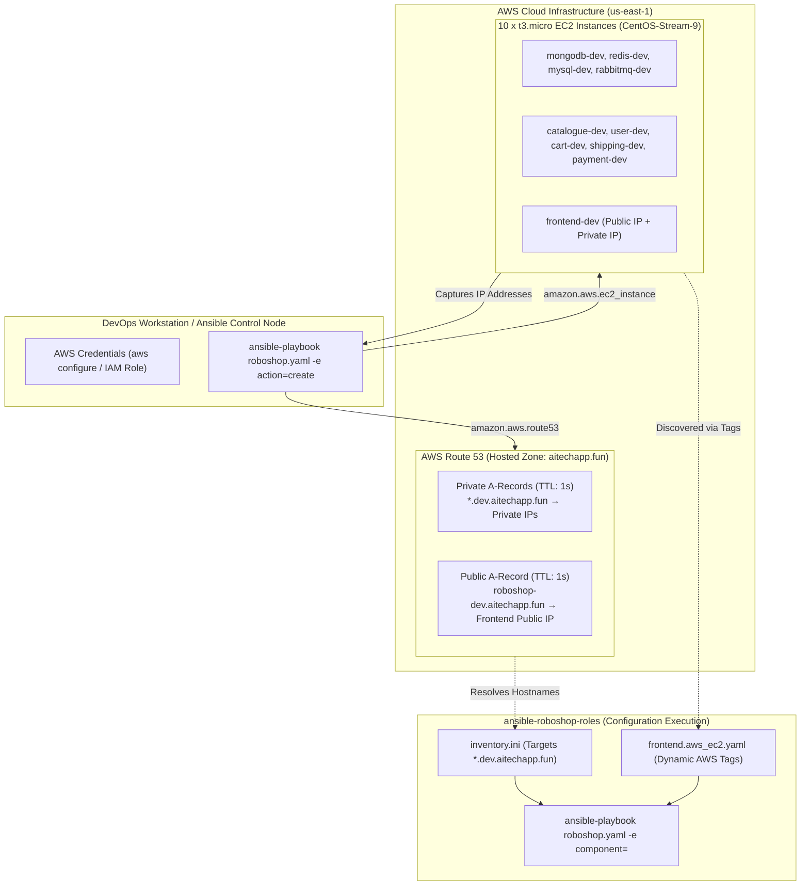

---

### 3. EC2 & Route 53 Provisioning Playbook Breakdown

The infrastructure provisioning playbook is defined in [roboshop-ansible/roboshop.yaml](file:///Users/sriramcharankolla/Desktop/DevOps/roboshop-ansible/roboshop.yaml#L1-L94). Here is its end-to-end execution flow:

1. **Variables & Parameters Block ([roboshop.yaml:L6-L15](file:///Users/sriramcharankolla/Desktop/DevOps/roboshop-ansible/roboshop.yaml#L6-L15)):**
   - `sg_id`: AWS Security Group ID granting ingress for SSH (22), HTTP (80), Application (8080), and database ports.
   - `ami_id`: AMI for CentOS-Stream-9 / RHEL-9 (`ami-0220d79f3f480ecf5`).
   - `domain_name`: Hosted zone domain (`aitechapp.fun`).
   - `env`: Environment prefix (`dev`).
   - `instances`: List of 10 microservices (`mongodb`, `catalogue`, `redis`, `user`, `cart`, `mysql`, `shipping`, `rabbitmq`, `payment`, `frontend`).

2. **EC2 Provisioning Task ([roboshop.yaml:L17-L30](file:///Users/sriramcharankolla/Desktop/DevOps/roboshop-ansible/roboshop.yaml#L17-L30)):**
   - Uses the `amazon.aws.ec2_instance` module to launch a `t3.micro` instance for each entry in `instances`.
   - Automatically tags each instance with `Project: roboshop`, `Environment: dev`, `Component: {{ item }}`, and `Name: {{ item }}-dev`.
   - Registers all output attributes (instance IDs, private/public IPs) into `ec2_output`.

3. **Route 53 Internal DNS Task ([roboshop.yaml:L37-L49](file:///Users/sriramcharankolla/Desktop/DevOps/roboshop-ansible/roboshop.yaml#L37-L49)):**
   - Uses `amazon.aws.route53` module.
   - Iterates through `ec2_output.results` and creates an `A` record for each service:
     `{{ item.item }}-dev.aitechapp.fun` pointing to `item.instances[0].private_ip_address` with a low TTL (`1s`) for instantaneous DNS propagation.

4. **Route 53 Public DNS Task for Frontend ([roboshop.yaml:L50-L61](file:///Users/sriramcharankolla/Desktop/DevOps/roboshop-ansible/roboshop.yaml#L50-L61)):**
   - Maps the public domain `roboshop-dev.aitechapp.fun` directly to the `frontend` instance's `public_ip_address`, allowing internet clients to access the web store.

5. **Teardown & Clean Destruction ([roboshop.yaml:L63-L94](file:///Users/sriramcharankolla/Desktop/DevOps/roboshop-ansible/roboshop.yaml#L63-L94)):**
   - When `action == "destroy"`, Ansible safely terminates the EC2 instances and deletes the Route 53 records.

---

### 4. Infrastructure Creation Commands

#### Pre-requisite: AWS Credentials & Python Libraries
On your Ansible control node, ensure AWS credentials and SDK dependencies are configured:
```bash
# 1. Configure AWS Credentials
aws configure
# Or export via environment variables:
export AWS_ACCESS_KEY_ID="your_access_key"
export AWS_SECRET_ACCESS_KEY="your_secret_key"
export AWS_DEFAULT_REGION="us-east-1"

# 2. Verify AWS Python SDK dependencies
python3 -m pip install boto3 botocore
```

#### Provision All 10 EC2 Instances & Route 53 Records
Execute the provisioning playbook from the `roboshop-ansible` directory:
```bash
cd /Users/sriramcharankolla/Desktop/DevOps/roboshop-ansible

ansible-playbook -i localhost, \
  -e '{"instances":["mongodb","catalogue","redis","user","cart","mysql","shipping","rabbitmq","payment","frontend"]}' \
  -e action=create \
  roboshop.yaml
```

#### Provision Specific Components (e.g. Databases Only)
```bash
ansible-playbook -i localhost, \
  -e '{"instances":["mongodb","redis","mysql","rabbitmq"]}' \
  -e action=create \
  roboshop.yaml
```

---

### 5. How Route 53 Integrates with `inventory.ini`

Once the provisioning playbook completes, AWS Route 53 hosts the following private endpoints:

| Component | Route 53 DNS Record | IP Target | Mapped Group in [inventory.ini](file:///Users/sriramcharankolla/Desktop/DevOps/ansible-roboshop-roles/inventory.ini#L1-L34) |
| :--- | :--- | :--- | :--- |
| **MongoDB** | `mongodb-dev.aitechapp.fun` | Private IP | `[mongodb]` |
| **Catalogue** | `catalogue-dev.aitechapp.fun` | Private IP | `[catalogue]` |
| **Redis** | `redis-dev.aitechapp.fun` | Private IP | `[redis]` |
| **User** | `user-dev.aitechapp.fun` | Private IP | `[user]` |
| **Cart** | `cart-dev.aitechapp.fun` | Private IP | `[cart]` |
| **MySQL** | `mysql-dev.aitechapp.fun` | Private IP | `[mysql]` |
| **Shipping** | `shipping-dev.aitechapp.fun` | Private IP | `[shipping]` |
| **RabbitMQ** | `rabbitmq-dev.aitechapp.fun` | Private IP | `[rabbitmq]` |
| **Payment** | `payment-dev.aitechapp.fun` | Private IP | `[payment]` |
| **Frontend** | `frontend-dev.aitechapp.fun` | Private IP | `[frontend]` |
| **Public Store** | `roboshop-dev.aitechapp.fun` | Public IP | Web Gateway |

Because [inventory.ini:L1-L34](file:///Users/sriramcharankolla/Desktop/DevOps/ansible-roboshop-roles/inventory.ini#L1-L34) references these exact DNS hostnames, Ansible seamlessly resolves each target server without needing manual IP tracking.

---

### 6. DNS Resolution & Network Connectivity Pre-Flight Check

Before running configuration roles, verify that all hostnames resolve and SSH connectivity is established:

```bash
# 1. Verify Route 53 DNS resolution from your workstation / control node
for host in mongodb catalogue redis user cart mysql shipping rabbitmq payment frontend; do
  echo -n "$host-dev.aitechapp.fun: "
  dig +short "$host-dev.aitechapp.fun"
done

# 2. Test SSH Ping to all nodes using Ansible
cd /Users/sriramcharankolla/Desktop/DevOps/ansible-roboshop-roles
ansible all -i inventory.ini -m ping
```

---

### 7. Infrastructure Teardown / Decommissioning Command

When you are finished testing and wish to avoid unnecessary AWS cloud costs, terminate all instances and purge Route 53 DNS records with a single command:

```bash
cd /Users/sriramcharankolla/Desktop/DevOps/roboshop-ansible

ansible-playbook -i localhost, \
  -e '{"instances":["mongodb","catalogue","redis","user","cart","mysql","shipping","rabbitmq","payment","frontend"]}' \
  -e action=destroy \
  roboshop.yaml
```

---

## 9. Step-by-Step Deployment Runbook (Ansible Roles Execution)

> [!TIP]
> **Why `-i inventory.ini` is optional:** Because [ansible.cfg:L3](file:///Users/sriramcharankolla/Desktop/DevOps/ansible-roboshop-roles/ansible.cfg#L3) explicitly declares `inventory = inventory.ini` under `[defaults]`, Ansible automatically loads `inventory.ini` when run from this directory. Specifying `-i inventory.ini` produces the exact same outcome as omitting it, but omitting it keeps commands clean. The `-i` flag is only strictly required when overriding the default (e.g. using `frontend.aws_ec2.yaml`).

Once infrastructure is provisioned and connectivity is verified, execute the roles from `ansible-roboshop-roles`:

### 1. Test Node Connectivity
Using default inventory from `ansible.cfg`:
```bash
ansible all -m ping
```

### 2. Deploy Database Tier
Deploy databases first so backend microservices can immediately establish connections:
```bash
ansible-playbook -e component=mongodb roboshop.yaml
ansible-playbook -e component=redis roboshop.yaml
ansible-playbook -e component=mysql roboshop.yaml
ansible-playbook -e component=rabbitmq roboshop.yaml
```

### 3. Deploy Backend Microservices
```bash
ansible-playbook -e component=catalogue roboshop.yaml
ansible-playbook -e component=user roboshop.yaml
ansible-playbook -e component=cart roboshop.yaml
ansible-playbook -e component=shipping roboshop.yaml
ansible-playbook -e component=payment roboshop.yaml
```

### 4. Deploy Frontend Web Gateway
```bash
ansible-playbook -e component=frontend roboshop.yaml
```

### 5. Deploying via Dynamic Inventory (`aws_ec2`)
To override the default inventory and discover EC2 instances dynamically via AWS tags:
```bash
ansible-playbook -i frontend.aws_ec2.yaml -e component=frontend roboshop.yaml
```

---

## 10. Deployment Execution Evidence (Terminal Runs)

> 📸 **Live Terminal Verification:** Verified logs demonstrating end-to-end cloud provisioning, configuration management role execution, inter-service API health tests, and automated decommissioning.

### 1. Cloud Infrastructure & DNS Provisioning (`deploying-1.png`)
*Ansible provisioning 10 EC2 instances (`t3.micro`) on AWS and generating Route 53 private & public DNS records in `aitechapp.fun`.*

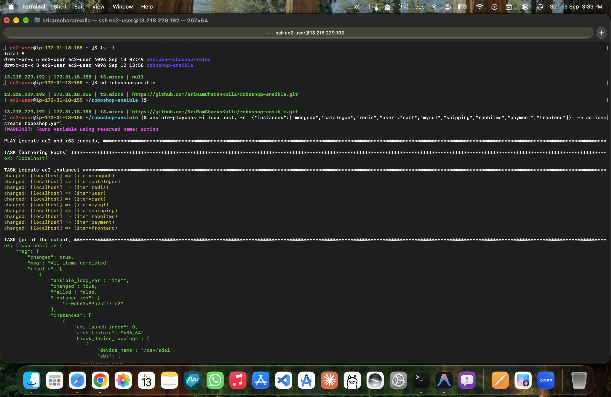

---

### 2. Redis & MySQL Database Roles Deployment (`deploying-2.png`)
*Configuration management playbook executing Redis cache setup and initiating MySQL database role with dynamic password retrieval.*

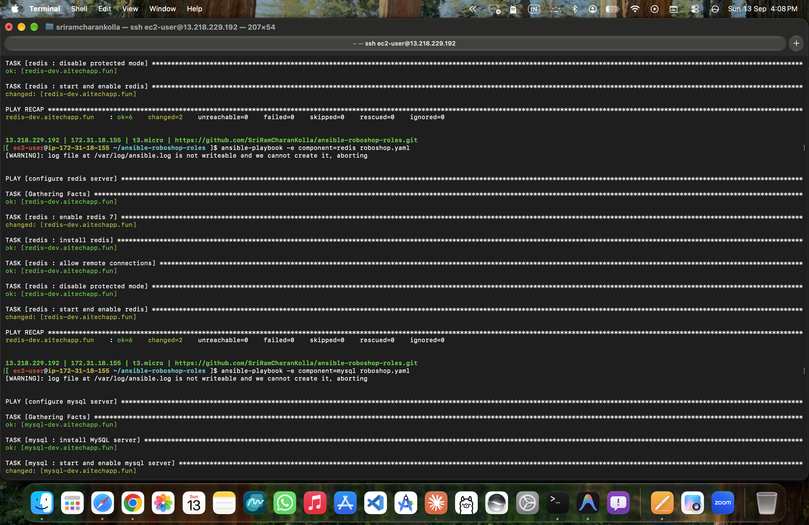

---

### 3. Frontend Role & End-to-End Microservices Health Checks (`deploying-3.png`)
*Deploying Nginx web gateway, configuring reverse-proxy upstream rules, and running ad-hoc HTTP curl tests validating live responses across all microservices (`catalogue`, `user`, `cart`, `shipping`, `payment`).*

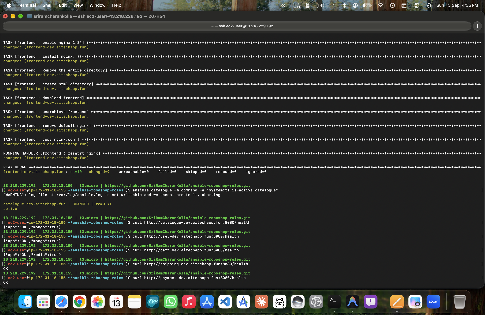

---

### 4. Automated Teardown & Cloud Cost Optimization (`deploying-4.png`)
*Executing automated infrastructure decommissioning playbook with `action=destroy`, terminating all EC2 instances and pruning Route 53 DNS records.*

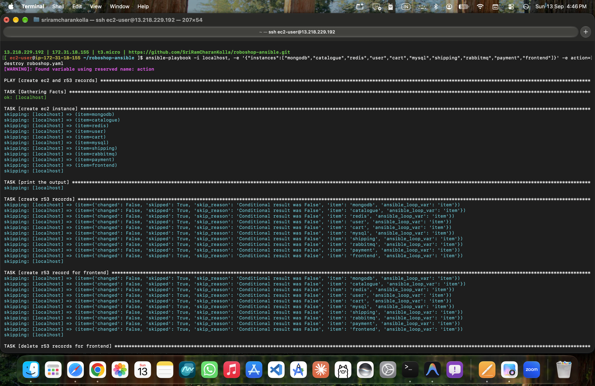

---

## 11. Verification, Health Checks & Troubleshooting

To ensure clear operational boundaries, verification and troubleshooting are divided into:
* **Part A: Run from Ansible Control Node / Workstation** (Network, DNS, SSH, and Ansible Ad-Hoc checks across all nodes).
* **Part B: Run directly inside each Component's EC2 Server** (Systemd status, internal listening sockets, application logs, and local curl endpoints).
* **Part C: Common Error Resolutions Runbook** (AWS Secrets Manager & permissions fixes).

---

### Part A: From Ansible Control Node / Workstation

These commands test external reachability, DNS propagation, and collective fleet health across your instances:

```bash
# 1. Verify Route 53 DNS resolution for all components
for host in mongodb catalogue redis user cart mysql shipping rabbitmq payment frontend; do
  echo -n "$host-dev.aitechapp.fun: "
  dig +short "$host-dev.aitechapp.fun"
done

# 2. Bulk SSH Ping across all inventory hosts
ansible all -m ping

# 3. Check service uptime across all nodes using Ansible Ad-Hoc command
ansible all -m command -a "uptime"

# 4. Check active systemd unit status across fleet without logging into each machine
ansible catalogue -m command -a "systemctl is-active catalogue"
ansible frontend -m command -a "systemctl is-active nginx"
ansible mysql -m command -a "systemctl is-active mysqld"
ansible mongodb -m command -a "systemctl is-active mongod"
ansible redis -m command -a "systemctl is-active redis"
ansible rabbitmq -m command -a "systemctl is-active rabbitmq-server"

# 5. End-to-End HTTP Web & API Gateway verification
curl -i http://roboshop-dev.aitechapp.fun/
```

---

### Part B: From Inside Each Target Component Server (via SSH)

SSH into the specific component VM to inspect deep internals:
```bash
# Example: SSH into a component instance
ssh ec2-user@catalogue-dev.aitechapp.fun
# (or ssh ec2-user@<private-ip>)
```

#### 1. Systemd Service Unit Verification
```bash
# Check service status (replace service name: catalogue, user, cart, shipping, payment, nginx, mysqld, mongod, redis, rabbitmq-server)
sudo systemctl status catalogue
sudo systemctl is-active catalogue
sudo systemctl is-enabled catalogue
```

#### 2. Port & Sockets Verification (`0.0.0.0` vs `127.0.0.1`)
Verify that services are listening on their designated ports and bound to `0.0.0.0` (all interfaces) rather than localhost `127.0.0.1`:
```bash
# View all listening TCP sockets with process names
sudo ss -lntp

# Component port reference:
# 80    -> Nginx (Frontend)
# 8080  -> Catalogue, User, Cart, Shipping, Payment
# 27017 -> MongoDB (must listen on 0.0.0.0 in /etc/mongod.conf)
# 6379  -> Redis (must listen on 0.0.0.0 in /etc/redis.conf or /etc/redis/redis.conf)
# 3306  -> MySQL
# 5672  -> RabbitMQ (AMQP)
sudo ss -lntp | grep -E ':80|:8080|:27017|:6379|:3306|:5672'
```

#### 3. Live Log Streaming
```bash
# Stream live application and service logs
sudo journalctl -u catalogue -f
sudo journalctl -u shipping -f
sudo journalctl -u mysqld -f
sudo journalctl -u mongod -f
sudo journalctl -u nginx -f

# Review application log directory if applicable
ls -la /var/log/
```

#### 4. Local Health Checks
```bash
# Microservice internal health endpoint (from inside the node)
curl http://localhost:8080/health

# Frontend Nginx local test
curl http://localhost:80/
```

---

### Part C: Common Errors & Resolution Runbook

#### Issue 1: `Failed to find secret roboshop/dev/mysql_root_password (ResourceNotFound)`
* **Symptoms:**
  ```text
  TASK [mysql : setup root password] *******************************************************************
  fatal: [mysql-dev.aitechapp.fun]: FAILED! => {
      "msg": "An unhandled exception occurred while templating '{{ (lookup('amazon.aws.aws_secret', 'roboshop/dev/mysql_root_password', region='us-east-1') | from_json).MYSQL_ROOT_PASSWORD }}'. Error was a <class 'ansible.errors.AnsibleLookupError'>, original message: Failed to find secret roboshop/dev/mysql_root_password (ResourceNotFound)"
  }
  ```
* **Root Cause:**
  In [roles/mysql/tasks/main.yaml:L12-L13](file:///Users/sriramcharankolla/Desktop/DevOps/ansible-roboshop-roles/roles/mysql/tasks/main.yaml#L12-L13) and [group_vars/mysql/vault.yaml:L1](file:///Users/sriramcharankolla/Desktop/DevOps/ansible-roboshop-roles/group_vars/mysql/vault.yaml#L1), Ansible executes a live lookup against **AWS Secrets Manager** in `us-east-1`. If the secret does not exist yet in AWS, AWS returns `ResourceNotFound`.
* **Fix (Run from Control Node / Workstation):**
  ```bash
  aws secretsmanager create-secret \
    --region us-east-1 \
    --name "roboshop/dev/mysql_root_password" \
    --description "Root password for RoboShop MySQL database" \
    --secret-string '{"MYSQL_ROOT_PASSWORD":"RoboShop@1"}'
  ```
  *(Verify secret is accessible:)*
  ```bash
  aws secretsmanager get-secret-value \
    --region us-east-1 \
    --secret-id "roboshop/dev/mysql_root_password" \
    --query SecretString \
    --output text
  ```

---

#### Issue 2: `[WARNING]: log file at /var/log/ansible.log is not writeable and we cannot create it, aborting`
* **Symptoms:**
  Ansible displays a warning at the beginning of playbook runs about `/var/log/ansible.log`.
* **Root Cause:**
  In [ansible.cfg:L4](file:///Users/sriramcharankolla/Desktop/DevOps/ansible-roboshop-roles/ansible.cfg#L4), `log_path = /var/log/ansible.log` is configured. On local developer workstations (macOS/Linux), standard users lack write permission to `/var/log`.
* **Fix (Run from Control Node):**
  ```bash
  sudo touch /var/log/ansible.log
  sudo chmod 666 /var/log/ansible.log
  ```


