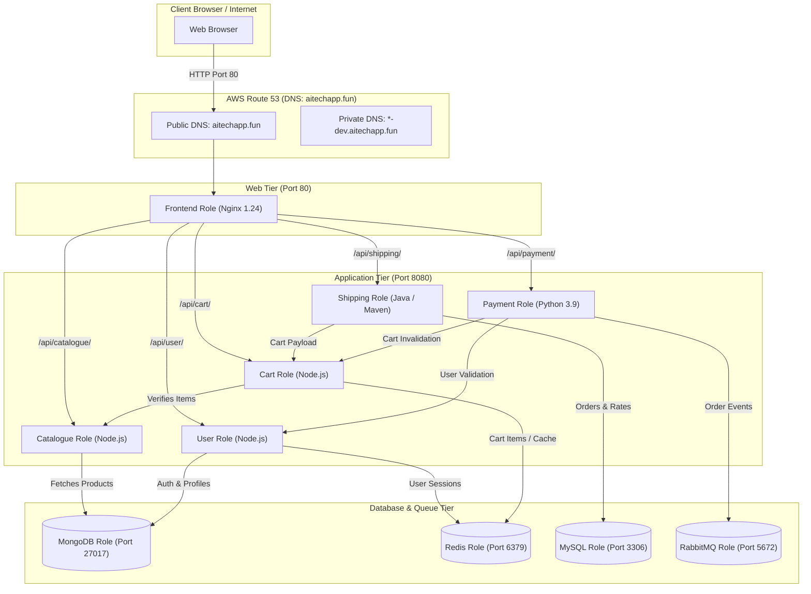
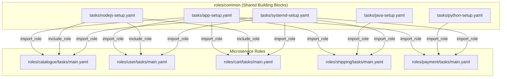

# RoboShop Enterprise Configuration with Ansible Roles & AWS Secrets Manager (`ansible-roboshop-roles`)

> Enterprise Configuration Management for the RoboShop Multi-Tier Microservices Architecture featuring **Ansible Roles**, **AWS Secrets Manager & SSM Parameter Store Lookups**, **Rolling Updates (`serial: 3`)**, **AWS Dynamic Inventory (`aws_ec2`)**, and **Shared Task Inheritance (`roles/common`)**.

---

## 📑 Table of Contents
1. [Project Overview](#project-overview)
2. [Key Enterprise Architecture Highlights](#key-enterprise-architecture-highlights)
3. [High-Level System Architecture & Flowchart](#high-level-system-architecture--flowchart)
4. [Role Architecture & Reusable Common Layer](#role-architecture--reusable-common-layer)
5. [Enterprise Best Practices in this Repository](#enterprise-best-practices-in-this-repository)
   - [AWS Secrets Manager Integration (`group_vars/mysql/vault.yaml`)](#1-aws-secrets-manager-integration-group_varsmysqlvaultyaml)
   - [Rolling Deployments with `serial: 3` (`roboshop.yaml`)](#2-rolling-deployments-with-serial-3-roboshopyaml)
   - [AWS EC2 Dynamic Inventory Plugin (`frontend.aws_ec2.yaml`)](#3-aws-ec2-dynamic-inventory-plugin-frontendaws_ec2yaml)
   - [Static vs Dynamic Task Composition (`import_role` vs `include_role`)](#4-static-vs-dynamic-task-composition-import_role-vs-include_role)
6. [Component Roles Deep Dive](#component-roles-deep-dive)
   - [Database Roles (MongoDB, Redis, MySQL, RabbitMQ)](#1-database-roles)
   - [Microservice Roles (Catalogue, User, Cart, Shipping, Payment)](#2-microservice-roles)
   - [Web Tier Role (Frontend / Nginx)](#3-web-tier-role)
7. [Step-by-Step Deployment Runbook](#step-by-step-deployment-runbook)
8. [Verification, Health Checks & Troubleshooting](#verification-health-checks--troubleshooting)

---

## Project Overview

Managing configurations across 10 distributed microservices in multi-instance production environments demands strict security, zero downtime, and code reusability.

**`ansible-roboshop-roles`** represents an enterprise-ready implementation of Ansible for the RoboShop platform:
* **Fully Modularized Roles:** Replaces monolithic playbooks with structured, self-contained roles in the `roles/` directory.
* **Secrets Management without Hardcoding:** Sensitive credentials (such as database root passwords) are fetched dynamically at runtime from **AWS Secrets Manager** or **SSM Parameter Store** using Jinja2 lookup plugins.
* **Zero-Downtime Rolling Updates:** Playbooks implement `serial: 3` batches, updating a subset of servers at a time to keep services available during releases.
* **Dynamic Inventory Discovery:** The `amazon.aws.aws_ec2` plugin automatically discovers running instances by AWS tags without requiring manually maintained IP lists.

---

## Key Enterprise Architecture Highlights

| Feature | Standard Playbook Approach | Enterprise Roles Approach (`ansible-roboshop-roles`) |
| :--- | :--- | :--- |
| **Code Organization** | Everything in flat `.yaml` files. Hard to scale. | Dedicated subdirectories (`tasks/`, `handlers/`, `templates/`, `files/`, `vars/`) per component. |
| **Secrets Management** | Hardcoded passwords or local files. | Dynamic runtime lookups via `lookup('amazon.aws.aws_secret')`. |
| **Deployment Strategy** | All hosts updated simultaneously (downtime risk). | Rolling deployment (`serial: 3`) across host batches. |
| **Inventory** | Static IP addresses in `inventory.ini`. | AWS EC2 Dynamic Inventory (`frontend.aws_ec2.yaml`). |
| **Code Reuse** | Repeated logic across playbooks. | Centralized [roles/common](file:///Users/sriramcharankolla/Desktop/DevOps/ansible-roboshop-roles/roles/common) imported across all microservices. |

---

## High-Level System Architecture & Flowchart



---

## Role Architecture & Reusable Common Layer



### Shared Tasks in [roles/common/tasks](file:///Users/sriramcharankolla/Desktop/DevOps/ansible-roboshop-roles/roles/common/tasks):
* **`app-setup.yaml`:** Provisions system user `roboshop`, manages `/app`, downloads and unarchives S3 artifacts.
* **`nodejs-setup.yaml`:** Configures Node.js 20 stream, installs packages, executes `npm install`.
* **`java-setup.yaml`:** Packages Java artifact via Maven (`mvn clean package`) and renames target JAR.
* **`python-setup.yaml`:** Configures Python 3, gcc, build tools, and runs `pip3 install -r requirements.txt`.
* **`systemd-setup.yaml`:** Deploys Jinja2 service unit template, runs `daemon-reload`, enables and starts service.

---

## Enterprise Best Practices in this Repository

### 1. AWS Secrets Manager Integration (`group_vars/mysql/vault.yaml`)
Passwords and secrets are **never** committed to Git in plaintext. Instead, [group_vars/mysql/vault.yaml](file:///Users/sriramcharankolla/Desktop/DevOps/ansible-roboshop-roles/group_vars/mysql/vault.yaml#L1-L2) dynamically queries AWS Secrets Manager:

```yaml
MYSQL_ROOT_PASSWORD: "{{ (lookup('amazon.aws.aws_secret', 'roboshop/dev/mysql_root_password', region='us-east-1') | from_json).MYSQL_ROOT_PASSWORD }}"
```
During execution of [roles/mysql/tasks/main.yaml](file:///Users/sriramcharankolla/Desktop/DevOps/ansible-roboshop-roles/roles/mysql/tasks/main.yaml#L12-L13), Ansible retrieves the secret in memory and executes:
```yaml
- name: setup root password
  ansible.builtin.command: mysql_secure_installation --set-root-pass "{{ MYSQL_ROOT_PASSWORD }}"
```

### 2. Rolling Deployments with `serial: 3` (`roboshop.yaml`)
In [roboshop.yaml:L1-L6](file:///Users/sriramcharankolla/Desktop/DevOps/ansible-roboshop-roles/roboshop.yaml#L1-L6), the `serial` directive controls concurrency:

```yaml
- name: "configure {{ component }} server"
  hosts: "{{ component }}"
  become: yes
  serial: 3
  roles:
  - "{{ component }}"
```
* **How it works:** If you have 9 instances of a service, Ansible executes the play on **3 instances at a time**.
* The remaining 6 instances continue serving customer traffic, ensuring high availability and zero downtime during upgrades.

### 3. AWS EC2 Dynamic Inventory Plugin (`frontend.aws_ec2.yaml`)
[frontend.aws_ec2.yaml:L1-L15](file:///Users/sriramcharankolla/Desktop/DevOps/ansible-roboshop-roles/frontend.aws_ec2.yaml#L1-L15) eliminates the need to manually update IP addresses:
```yaml
plugin: amazon.aws.aws_ec2
regions:
- us-east-1
hostnames:
- private-ip-address
filters:
  instance-state-name: running
  tag:Name: frontend-dev
compose:
  ansible_host: private_ip_address
keyed_groups:
- separator: ''
  key: tags.Name | regex_replace('-.*$', '')
```

### 4. Static vs Dynamic Task Composition (`import_role` vs `include_role`)
Demonstrated in [include-vs-import.yaml](file:///Users/sriramcharankolla/Desktop/DevOps/ansible-roboshop-roles/include-vs-import.yaml#L1-L5):
* `import_role`: Static pre-processing at playbook compile time. Used for structural blocks like `app-setup` and `systemd-setup`.
* `include_role`: Dynamic runtime inclusion. Supports loops and dynamically evaluated conditionals.

---

## Component Roles Deep Dive

### 1. Database Roles
* **MongoDB (`roles/mongodb`):** Installs `mongodb-org`, configures bind IP `0.0.0.0` in `/etc/mongod.conf`, enables and starts `mongod`.
* **Redis (`roles/redis`):** Enables `redis:7` module, updates `redis.conf` (`0.0.0.0`, `protected-mode no`), enables and starts `redis`.
* **MySQL (`roles/mysql`):** Installs MySQL server, starts daemon, and sets root password dynamically fetched from AWS Secrets Manager.
* **RabbitMQ (`roles/rabbitmq`):** Deploys Erlang/RabbitMQ repo, installs server, creates user `roboshop`/`roboshop123` with full permissions.

### 2. Microservice Roles
* **Catalogue (`roles/catalogue`):** Composes `app-setup`, `nodejs-setup`, and `systemd-setup`. Verifies catalog database in MongoDB before seeding `master-data.js`.
* **User (`roles/user`):** Composes Node.js stack; templates MongoDB and Redis endpoints.
* **Cart (`roles/cart`):** Composes Node.js stack; templates Redis and Catalogue endpoints.
* **Shipping (`roles/shipping`):** Composes `java-setup` Maven packaging; seeds `cities` schema in MySQL.
* **Payment (`roles/payment`):** Composes `python-setup`; integrates RabbitMQ, Cart, and User endpoints.

### 3. Web Tier Role
* **Frontend (`roles/frontend`):** Installs Nginx 1.24, unarchives frontend static assets to `/usr/share/nginx/html`, renders dynamic `nginx.conf` reverse proxy routing, and restarts Nginx via handlers.

---

## Step-by-Step Deployment Runbook

### 1. Test Node Connectivity
Using the inventory file [inventory.ini](file:///Users/sriramcharankolla/Desktop/DevOps/ansible-roboshop-roles/inventory.ini#L1-L34):
```bash
ansible all -i inventory.ini -m ping
```

### 2. Deploy Database Tier
```bash
ansible-playbook -i inventory.ini -e component=mongodb roboshop.yaml
ansible-playbook -i inventory.ini -e component=redis roboshop.yaml
ansible-playbook -i inventory.ini -e component=mysql roboshop.yaml
ansible-playbook -i inventory.ini -e component=rabbitmq roboshop.yaml
```

### 3. Deploy Backend Microservices
```bash
ansible-playbook -i inventory.ini -e component=catalogue roboshop.yaml
ansible-playbook -i inventory.ini -e component=user roboshop.yaml
ansible-playbook -i inventory.ini -e component=cart roboshop.yaml
ansible-playbook -i inventory.ini -e component=shipping roboshop.yaml
ansible-playbook -i inventory.ini -e component=payment roboshop.yaml
```

### 4. Deploy Frontend Web Gateway
```bash
ansible-playbook -i inventory.ini -e component=frontend roboshop.yaml
```

### 5. Using Dynamic Inventory:
```bash
ansible-playbook -i frontend.aws_ec2.yaml -e component=frontend roboshop.yaml
```

---

## Verification, Health Checks & Troubleshooting

```bash
# Check service status on target instance
sudo systemctl status catalogue
sudo systemctl status nginx

# Review live systemd logs
sudo journalctl -u catalogue -f
sudo journalctl -u shipping -f

# Verify API and Nginx proxy health
curl http://localhost/health
curl http://localhost:8080/health
```
